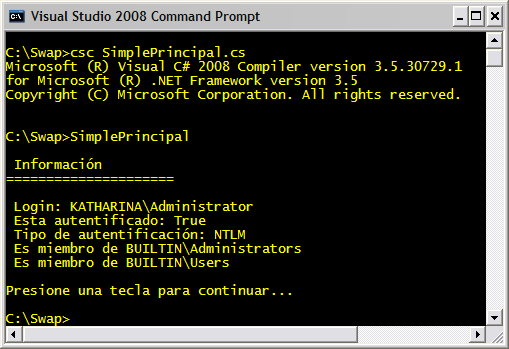
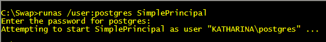
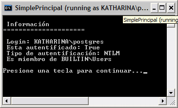
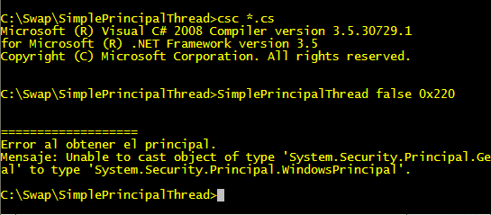
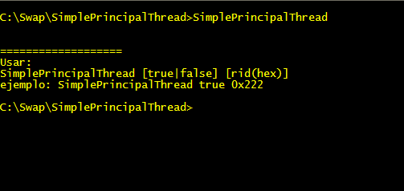
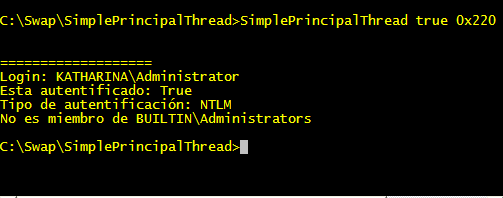

# Conceptos Básicos de seguridad en .NET (parte II)

<h3>Autorización</h3>

La autorización ocurre inmediatamente después de la autenticación y es como el sistema determina que recursos pueden utilizarse de acuerdo con la autenticación, regresando a la analogía del edificio la autorización ocurre después que nos identificamos (autenticación) ante el guardia y le decimos a que piso vamos, entonces nos da un gafete con el número de piso y que nos autoriza movernos únicamente en ese piso mientras nos encontremos dentro el edificio.

<h3>La interfaz IPrincipal</h3>

El modelo de seguridad basado en roles (roled-based security o RBS) permite controlar el acceso de los usuarios a los recursos en base a su identidad y su pertenencia a un grupo o membership, este modelo esta diseñado para ser independiente de la plataforma donde se implemente por lo que .NET utiliza el concepto de principal (representado por la interfaz IPrincipal) como una forma de abstraer este modelo y encapsular la información acerca del contexto de seguridad (security context) de la entidad (usuario o objeto) que ejecuta el código.

Hay diferentes tipos de objetos Principal cada uno para cada tipo de identidad y de membership, .NET proporciona los siguientes tipos de principales.

<b>Windows Principal:</b> Si utilizamos la seguridad Integrada de Windows este objeto representa la identidad, la autenticación y los roles de Windows.

<b>Generic Principal:</b> Representa una seguridad a nivel aplicación, independiente de la seguridad de Windows, los roles y los usuarios utilizan un método personalizado de autenticación como por ejemplo una tabla en una base de datos.

Hay dos técnicas para crear objetos Principal dependiendo de si una aplicación requiere hacer la validación algunas veces o durante toda su ejecución. Vamos a mostrar estas formas utilizando como ejemplo el objeto WindowsPrincipal.

La primera técnica se recomienda si requerimos hacer la validación de cierto código algunas veces durante la ejecución, la sintaxis es:

<pre>
WindowsIdentity wi = WindowsIdentity.GetCurrent();
WindowsPrincipal wp = new WindowsPrincipal(wi);
</pre>

En esas lineas, primero obtenemos una instancia de WindowsIdentity al consultar la cuenta de Windows que ejecuta el código con el método GetCurrent y después la usamos como parámetro para construir un objeto WindowsPrincipal.

La segunda técnica se utiliza si requerimos hacer la validación durante toda la ejecución de la aplicación entonces en este caso debemos establecer la seguridad de Windows a nuestro hilo principal de ejecución ya que .NET de forma predeterminada no estable esa propiedad, entonces la sintaxis es la siguiente:

<pre>
AppDomain.CurrentDomain.SetPrincipalPolicy(PrincipalPolicy.WindowsPrincipal);
WindowsPrincipal wp = (WindowsPrincipal)Thread.CurrentPrincipal;
</pre>

En esas líneas primeramente establecemos la política de autorización al dominio de la aplicación con el valor de la enumeración PrincipalPolicy , después obtenemos el Principal del hilo de ejecución y hacemos un casting a un objeto WindowsPrincipal, si no establecemos la política no podremos hacer el casting de Thread.CurrentPrincipal a WindowsPrincipal ya que como mencionamos anteriormente .NET no establece esta propiedad.

Una vez teniendo el objeto WindowsPrincipal además de las propiedades y métodos de la clase WindowsIdentity podemos determinar su pertenencia a un grupo o rol, con el método IsInRole. El método IsInRole de WindowsPrincipal tiene tres sobrecargas la primera recibe como argumento una cadena conteniendo el nombre del grupo o rol que debe escribirse para grupos basados en dominios de la siguiente forma:

<pre>
[NombreDelDominio]\[Grupo]
</pre>
O de la siguiente forma si es para grupos de la computadora local.
<pre>
[NombreDeLaMaquina]\[Grupo]
</pre>
La segunda sobrecarga recibe un RID (Role Identifier) y la tercera recibe una enumeración <i>WindowsBuiltInRole</i>

La tabla siguiente lista los identificadores del rol con su correspondiente valor en la enumeración WindowsBuiltInRole

<pre>
+----------------+------+
|AccountOperator |0x224 |
|Administrator   |0x220 |
|BackupOperator  |0x227 |
|Guest           |0x222 |
|PowerUser       |0x223 |
|PrintOperator   |0x226 |
|Replicator      |0x228 |
|SystemOperator  |0x225 |
|User            |0x221 |
+----------------+------+
</pre>

El siguiente programa demuestra el uso de la primera técnica de validación para conocer la autorización de una entidad. 

Al compilar y ejecutar el programa con una cuenta de administrador mostrará el siguiente resultado:

Ahora bien, si ejecutamos el programa con el comando
<pre>
runas /user:[Usuario] [Programa]
</pre>
en este caso con la cuenta del usuario postgres,como se muestra en la imagen:

El programa mostrará el siguiente resultado:

Y ahora demostramos la segunda técnica utilizando la política del dominio de la aplicación, algo más elaborado que el ejemplo anterior. Descarga el código fuente de este ejemplo de este enlace. Al compilar las clases y ejecutar el programa con la opción false nos mostrará la excepción de que no hemos establecido una política de autorización.

Si ejecutamos el programa sin argumentos nos mostrará las instrucciones de uso.

Si ejecutamos el programa correctamente,nos mostrará la información como en la siguiente imagen

